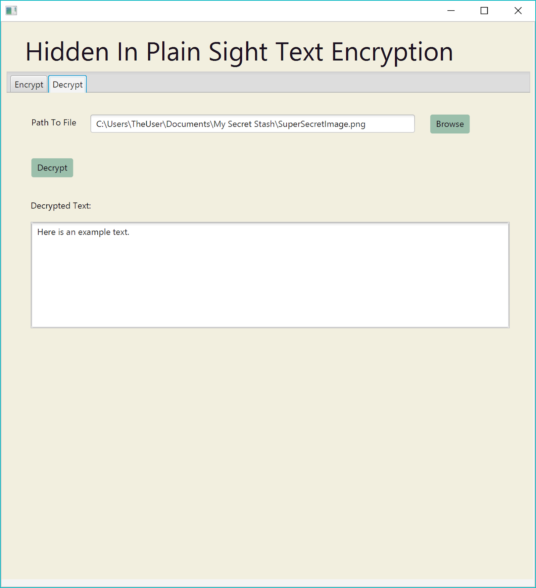

# UofC 1stYear CPSC233 Project
Hidden In Plain Sight 
This program allows the user to encrypt/hide text in images and decrypt/uncover text from images. 

### Dependencies:
Make sure you have java 8.0 downloaded and your path in command prompt or terminal is set to this folder. 
## Deployment:

### Text-Based 
Open command prompt and set the directory to the HiddenInPlainSight file directory.

#### To Complie: 
Type: 
```
javac HIPS/backend/*.java 
```
into the command prompt or terminal and hit enter.
Type: 
```
javac HIPS/Runner/*.java 
```
into the command prompt or terminal and hit enter.
	
#### To Run: 
Type:
```
java HIPS.Runner.HiddenInPlainSight 
```
into the command prompt or terminal and hit enter.

You will be prompted:
```
Hello!
Do you want to Encrypt or Decrypt? Or Q to quit.
```
From there follow the onscreen instructions to Encrypt or Decrypt. 


### GUI 
Open command prompt and set the directory to the HiddenInPlainSight file directory.

Double click the the runme Windows bat file in the main directory. If you are on a unix machine, compile manually. 

The Gui will pop up.


or 

To run the Gui manually


To Complie: Type: 
```
javac HIPS/backend/*.java
```
into the command prompt or terminal and hit enter. Type: 
```
javac HIPS/Runner/*.java 
```

into the command prompt or terminal and hit enter.

To Run: Type: 
```
java HIPS.Runner.Gui
```    
into the command prompt or terminal and hit enter.
## Running the GUI
1. Encrypting text
	1. To encrypt text, first select the “Encrypt” tab if you have not already done so.
	2. Enter your desired text into the text field.
	3. You may choose to encrypt to a specific image by clicking the “Choose Image” button and selecting your image. Otherwise, a default image is used. (The default is a red 10x12 .png image.) 
	4. Click the “Encrypt” button to encrypt the text to the image. Your image will be previewed in the lower box. 
		(Figure 1 shows the resulting previewed image using the default image.)
	5. To save the encrypted image, click “Save Image”. 
	NOTE: You must save your image using either the .png or .jpg extension.
	(Figure 2 shows the file explorer after clicking “Save Image”.)
2. Decrypting an image
	1. To decrypt an image, first select the “Encrypt” tab if you have not already done so.
	2. Browse to the image you wish to decrypt by clicking the “Browse” button. 
	NOTE: The selected image must have the .png or .jpg extension.
	(Figure 3 shows the file explorer after clicking “Browse”.)
	3.Click “Decrypt” to decrypt the image. The decrypted text will display in the box.
	(Figure 4 shows the resulting decrypted text after clicking “Decrypt”)
	
#### Figure 1


#### Figure 2

#### Figure 3 


#### Figure 4



## Testing 

How to Run the Tests using junit:
Open command prompt and set the directory to the HiddenInPlainSight file directory.

#### Windows:

1. junit-4.12.jar and hamcrest-core-1.3.jar are already in the folder (you do not need to redownload these).
2. Compile your code and the test code using the commands
```
javac -cp .;junit-4.12.jar;hamcrest-core-1.3.jar HIPS/testing/*.java
javac HIPS/backend/*.java 
javac HIPS/Runner/*.java
``` 
3. Run the test using the command 
```
java -cp .;junit-4.12.jar;hamcrest-core-1.3.jar org.junit.runner.JUnitCore HIPS.testing.RunTesting
```
#### Unix:

1. junit-4.12.jar and hamcrest-core-1.3.jar are already in the folder (you do not need to redownload these).
2. Compile your code and the test code using the commands 
```
javac -cp .:junit-4.12.jar:hamcrest-core-1.3.jar HIPS/testing/*.java
javac HIPS/backend/*.java 
javac HIPS/Runner/*.java
``` 
3. Run the test using the command 
```
java -cp .:junit-4.12.jar:hamcrest-core-1.3.jar org.junit.runner.JUnitCore HIPS.testing.RunTesting
```


Built With:
java8.0
javaFx


Authors:
Kaitlin de Chastelain Finnigan
Roxanne Duchesne
Jason Lagasca
Alexander Chao
